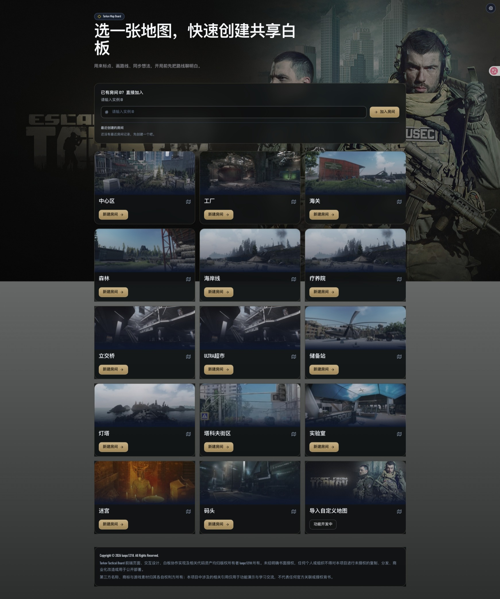
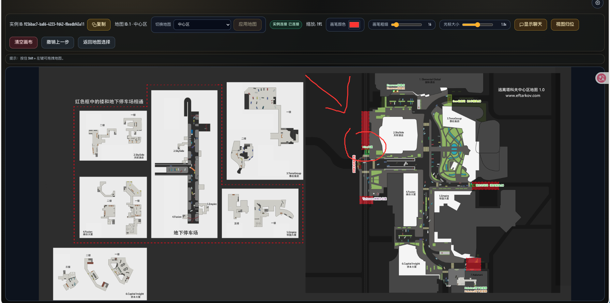

# Tarkov Tactical Board (Frontend)

[中文](#中文) | [English](#english)

- Web Demo: <https://luopc1218.github.io/tarkov-tactical-board/>
- Backend Repository: <https://github.com/luopc1218/tarkov-tactical-board-server>

> [!IMPORTANT]
> - 首次使用前请先配置 API 地址（例如 `/api` 或 `https://your-domain/api`）。
> - 应用内可通过设置按钮打开配置面板；桌面端快捷键：`Cmd/Ctrl + ,`。
> - 默认 API：开发环境为 `/api`，生产环境为 `https://81.71.150.227/api`（可在设置中覆盖）。
> - 当前演示服务资源有限，高峰时段可能出现加载变慢或短时卡顿，请稍后重试。

## Demo 截图 / Screenshots




## 中文

### 项目简介

这是一个用于《Escape from Tarkov》战术讨论的共享地图白板前端。你可以快速创建房间、分享实例 ID、多人实时标点和画路线。

### 下载与安装

当前最新稳定版（截至 **2026-03-04**）：**v1.5.5**

| 方式 | 地址 / 包名 |
| --- | --- |
| Web 版（免安装） | <https://luopc1218.github.io/tarkov-tactical-board/> |
| 桌面版下载（Releases） | <https://github.com/luopc1218/tarkov-tactical-board/releases> |
| Windows 安装包 | `Tarkov.Tactical.Board.Setup.*.exe` |
| macOS (Apple Silicon) 安装包 | `Tarkov.Tactical.Board-*-arm64.dmg` |

### 默认 API 与性能说明

- 开发环境默认 API：`/api`
- 生产环境默认 API：`https://81.71.150.227/api`
- 可在应用设置中覆盖默认值
- 公开演示服务资源有限，人数较多时可能出现延迟升高

### 快速使用

1. 打开应用后，进入设置并填写后端 API 地址（可选）。
2. 回到首页，选择地图并点击 `新建房间`。
3. 在地图实例页复制 `实例 ID` 并分享给队友。
4. 队友在首页通过 `已有房间 ID？直接加入` 进入同一房间。
5. 在实例页进行画线、标点、切换地图、聊天等实时协作操作。

### 管理端（可选）

- 入口：`/admin/login`
- 功能：地图管理、实例管理、管理员密码修改

### 常见问题

- **地图列表为空**：通常是 API 地址未配置或后端接口不可达。
- **连接状态未连接**：请检查后端服务、反向代理和 WebSocket 转发配置。
- **API 地址如何填写**：可使用 `/api` 或 `https://your-domain/api`，生产默认值为 `https://81.71.150.227/api`。
- **出现卡顿**：公开服务资源有限，高峰期可能有波动；可稍后重试或自建后端服务。

### 开发者（可选）

<details>
<summary>展开开发命令</summary>

```bash
npm install
npm run dev
npm run electron:dev
```

更多构建/打包脚本见 `package.json`。

</details>

## English

### Overview

A shared tactical map whiteboard frontend for Escape from Tarkov. Create an instance quickly, share the instance ID, and collaborate in real time.

### Download and Install

Latest stable version (as of **March 4, 2026**): **v1.5.5**

| Channel | Link / Package |
| --- | --- |
| Web demo | <https://luopc1218.github.io/tarkov-tactical-board/> |
| Desktop downloads (Releases) | <https://github.com/luopc1218/tarkov-tactical-board/releases> |
| Windows installer | `Tarkov.Tactical.Board.Setup.*.exe` |
| macOS (Apple Silicon) installer | `Tarkov.Tactical.Board-*-arm64.dmg` |

### Default API and Performance Notes

- Default API in development: `/api`
- Default API in production: `https://81.71.150.227/api`
- You can override the API base URL in settings
- Public demo server resources are limited, so occasional lag may happen during peak usage

### Quick Start

1. Open settings and configure the API base URL.
2. Choose a map and click `Create Instance`.
3. Copy and share the instance ID with teammates.
4. Teammates can join from home by entering the instance ID.
5. Use drawing, marking, map switching, and chat tools for real-time collaboration.

### Admin Portal (Optional)

- Entry: `/admin/login`
- Features: map management, instance management, admin password update

### Troubleshooting

- **No maps loaded**: API base URL is not configured correctly, or backend is unreachable.
- **Disconnected status**: check backend health, reverse proxy, and WebSocket forwarding.
- **API URL examples**: `/api` or `https://your-domain/api` (production default: `https://81.71.150.227/api`).
- **Lag spikes**: public server resources are limited; retry later or deploy your own backend.

### Developer Notes (Optional)

<details>
<summary>Show development commands</summary>

```bash
npm install
npm run dev
npm run electron:dev
```

See `package.json` for full build/package scripts.

</details>
